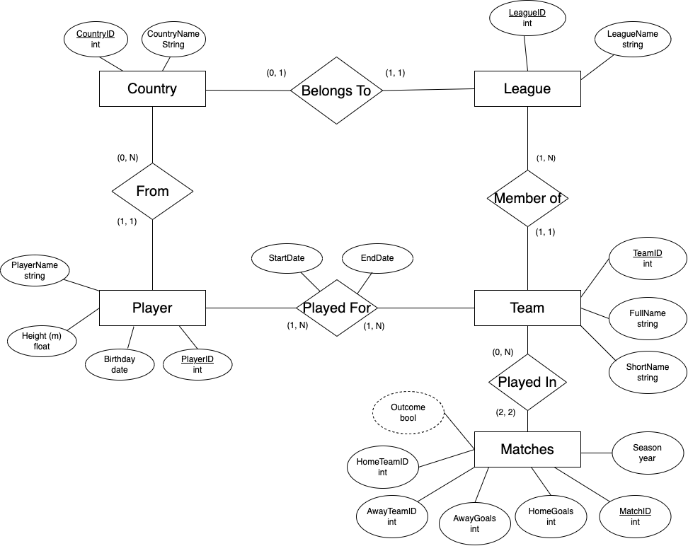
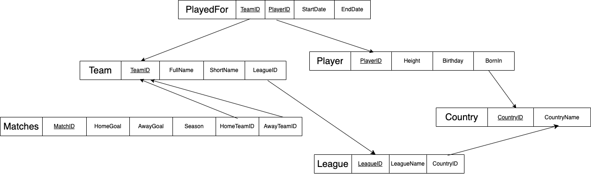

# MPCS-53001-FinalProject: European Soccer Analysis
Created by: Jayti Arora, Kevin Lim, Darshana Venkatadasan, Yuehan Wang

## ER Diagram


## Relational Schema


## How to Run The App
1. In MySQL create a DB

    `create database SoccerDB;`
2. Create tables for the database with the following:

    ```
    create table Country (
      CountryID int,
      CountryName varchar(20),
      Primary Key (CountryID)
    );

    create table League (
      LeagueID int,
      LeagueName varchar(40),
      CountryID int,
      Foreign Key (CountryID) references Country(CountryID),
      Primary Key (LeagueID)
    );

    create table Team (
      TeamID int,
      FullName varchar(40),
      ShortName varchar(10),
      LeagueID int,
      Foreign Key (LeagueID) references League(LeagueID),
      Primary Key (TeamID)
    );

    create table Player (
      PlayerID int,
      PlayerName varchar(40),
      Height decimal(5, 2),
      Birthday date,
      BornIn int,
      Foreign Key (BornIn) references Country(CountryID),
      Primary Key (PlayerID)
    );

    create table PlayedFor (
      PlayerID int,
      TeamID int,
      StartDate date,
      EndDate date,
      Foreign Key (PlayerID) references Player(PlayerID),
      Foreign Key (TeamID) references Team(TeamID),
      Primary Key (PlayerID, TeamID)
    );

    create table Matches (
      MatchID int,
      HomeGoals int,
      AwayGoals int,
      Season year,
      HomeTeamID int,
      AwayTeamID int,
      Foreign Key (HomeTeamID) references Team(TeamID),
      Foreign Key (AwayTeamID) references Team(TeamID),
      Primary Key (MatchID)
    );
    ```

3. Install SQL Connector and Flask with the following commans in the terminal:
    
    `python3 -m pip install mysql-connector-python`

    `python3 -m pip install flask`

4. Insert Data into the tables with the following command in the terminal:

    *Make sure to update the SQL password in insertData.py and queries.py*

    `python3 insertData.py`

5. Run the GUI:

    `python3 app.py`

    Open http://127.0.0.1:5000